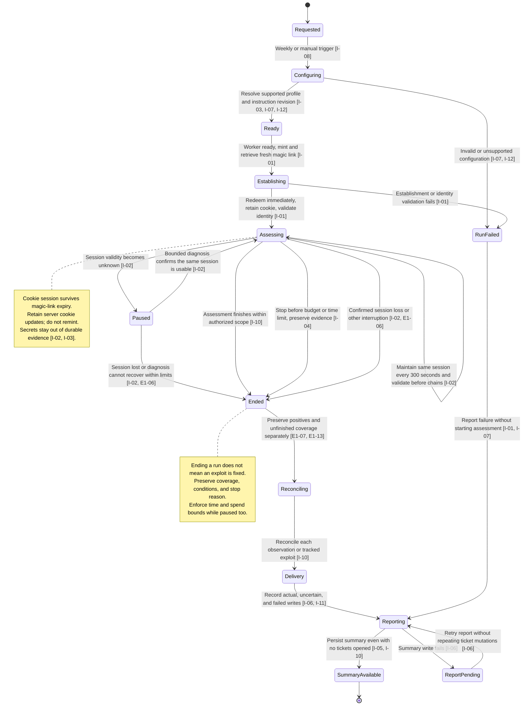
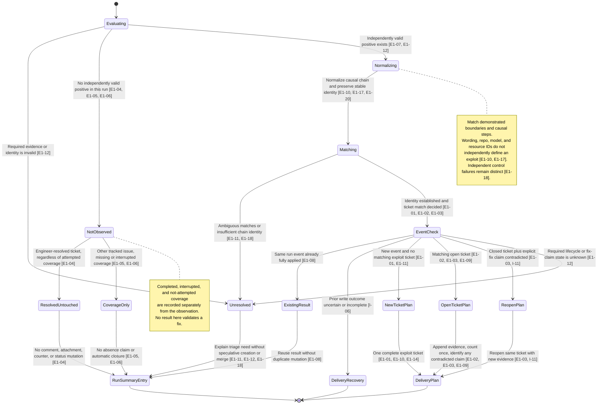
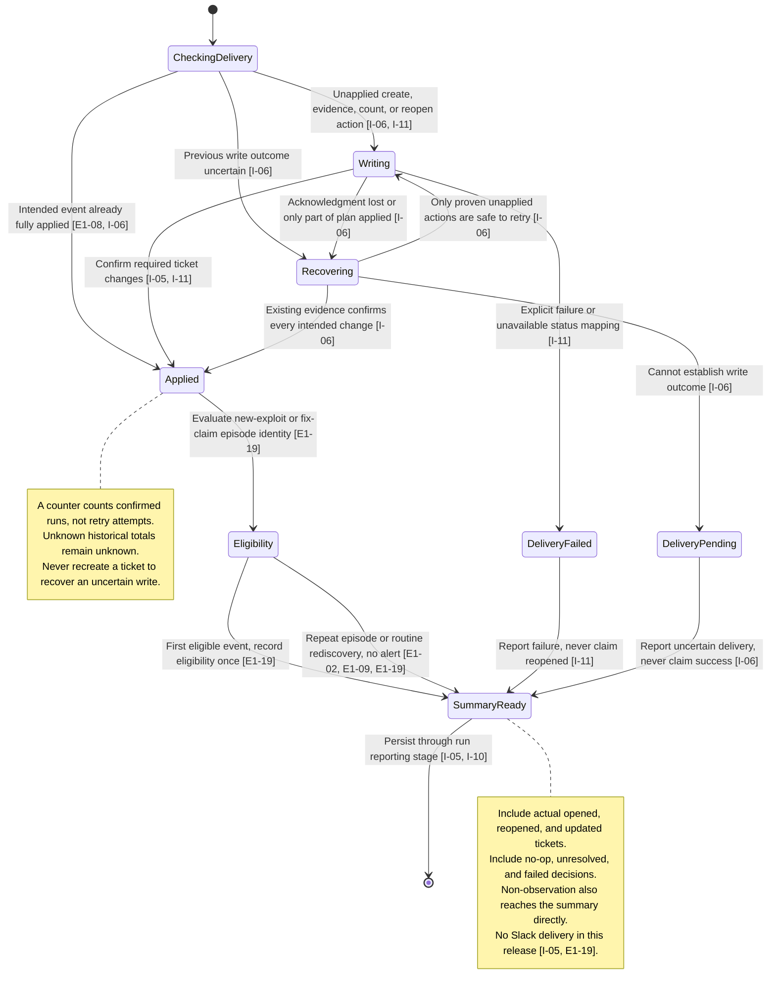

# Attack Runner state diagrams

These diagrams visualize the [acceptance criteria](acceptance.md); they do not replace them or record passing tests. The three machines separate run execution, per-exploit reconciliation, and external delivery. An ended run, an unobserved exploit, and a resolved ticket are different states.

Every criterion maps to a transition or invariant in the coverage table below. No diagram has a transition from non-observation to “fixed.” All ticket mutations shown in the reconciliation diagram are proposals in E1; only the integration delivery stage performs them.

## 1. Run lifecycle

The default profile uses Strix OSS and Sonnet-4-8, a $100 budget, and a 60-minute total job limit. The exact provider model identifier must be verified. Scheduled runs start Saturday at 07:00 America/Los_Angeles. Settings are replaceable; unsupported combinations fail explicitly. These defaults describe the integration service, not the offline E1 planner.

## 2. Per-exploit observation and ticket decision

`RunSummaryEntry` is written only to the run summary artifact, never to a Linear ticket. In E1-04, the resolved ticket receives no comment, attachment, counter change, or status update. The summary can link to that ticket without modifying it.

Apply this machine per finding or tracked exploit, not once to the entire batch. Keep valid independent positives when other findings are invalid or the run stops (E1-07, E1-12, E1-13). An unreadable entire input fails explicitly; it does not become an empty successful batch. Unknown repository ownership does not make an otherwise valid finding unresolved (E1-11). A partial component fix does not split the exploit or prove it resolved (I-09).

E1 ends with a deterministic proposal or summary decision and makes no external calls (E1-15). `DeliveryPlan` and `DeliveryRecovery` feed the next machine only during integration.

## 3. Ticket delivery, replay, and summary

An “applied” event means all intended actions are confirmed; creating a ticket alone does not prove that an evidence/count/reopen plan completed. Retry recovery must inspect what actually happened. Human-readable summaries and machine-readable decisions must not confuse proposed changes with completed writes.

## Acceptance coverage

Some criteria constrain every state rather than adding a state transition. In particular, fixture isolation and final-revision verification are quality gates, not runtime states. IDs below refer to the full scenarios in [acceptance criteria](acceptance.md).

| Criterion | Diagram or invariant                                  | Observable check                                                                                                                   |
| --------- | ----------------------------------------------------- | ---------------------------------------------------------------------------------------------------------------------------------- |
| E1-01     | 2: Matching → NewTicketPlan                           | One complete ticket proposal with chain, remediation, labels, qualified impact, and verification expectations                      |
| E1-02     | 2: OpenTicketPlan; 3: Eligibility                     | Existing open ticket gets evidence/count once; routine rediscovery creates no alert                                                |
| E1-03     | 2: OpenTicketPlan or ReopenPlan                       | Contradiction targets the same issue and fix claim; reopen only when closed                                                        |
| E1-04     | 2: NotObserved → ResolvedUntouched                    | Completed, interrupted, or unattempted tests leave resolved tickets completely untouched; summary only                             |
| E1-05     | 2: NotObserved → CoverageOnly                         | Absence from a finding list is not a negative/fixed conclusion or closure trigger                                                  |
| E1-06     | 1: Ended; 2: NotObserved                              | Record interrupted execution and cause separately from non-observation                                                             |
| E1-07     | 1: Ended → Reconciling; 2: Normalizing                | Positive evidence survives later session loss; unfinished coverage stays unfinished                                                |
| E1-08     | 2: EventCheck; 3: CheckingDelivery                    | Duplicate observations and replay do not repeat evidence/counter mutations                                                         |
| E1-09     | 2: OpenTicketPlan; 3: Eligibility                     | A different confirmed run adds one count without a rediscovery alert                                                               |
| E1-10     | 2: Normalizing → Matching                             | Same exploit stays one ticket across repos/harnesses/paths; independent exploits remain distinct                                   |
| E1-11     | 2: Matching → Unresolved or EventCheck                | Ambiguous identity goes to triage; unknown repo alone does not block a valid ticket                                                |
| E1-12     | 2: Evaluating; per-finding invariant                  | Invalid required data is unresolved; valid positives survive later non-observation; unreadable input fails explicitly              |
| E1-13     | 1: Reconciling; batch invariant                       | Preserve valid independent decisions and expose invalid ones; no false whole-batch success                                         |
| E1-14     | 2: NewTicketPlan; ticket-material invariant           | Unsupported production impact stays unknown with rationale; party evidence is not production proof                                 |
| E1-15     | E1 execution boundary                                 | Fixture planner emits proposals only; no network, secrets, external writes, harness, or workflow execution                         |
| E1-16     | Verification gate                                     | Reassess applicable acceptance on the final delivered code revision                                                                |
| E1-17     | 2: Normalizing → Matching                             | Paraphrases and incidental IDs/steps match one exploit with a recorded reason; preserve causal dependencies                        |
| E1-18     | 2: Matching                                           | Similar wording never merges independent failures; ambiguous partial chains go to triage                                           |
| E1-19     | 3: Eligibility; summary invariant                     | One eligible event per exploit/fix-claim episode; a new contradicted claim is a new episode; every run gets a summary              |
| E1-20     | 2: Normalizing; identity invariant                    | Fingerprint version changes preserve stable exploit IDs through migration or aliases                                               |
| I-01      | 1: Ready → Establishing → Assessing or RunFailed      | Distinct fresh link per run, immediate single redemption, validated non-admin cookie session, no attack after failed establishment |
| I-02      | 1: Assessing and Paused                               | Maintain the same cookie session beyond link expiry through the run; retain updates and stop on loss                               |
| I-03      | 1: Configuring → Ready; credential invariant          | Selected Git instruction revision/hash reaches harness; committed placeholder remains; no retained secrets                         |
| I-04      | 1: Assessing/Paused → Ended; limit invariant          | Enforce money/time bounds, reserve evidence cleanup, and do not claim unsupported limits are enforced                              |
| I-05      | 1: SummaryAvailable; 3: SummaryReady                  | Output the complete repo-independent ticket list with actual links and failed/unresolved actions; no Slack                         |
| I-06      | 1: ReportPending; 3: Recovering                       | Recover uncertain/partial writes and report failures without duplicate tickets, counts, or events                                  |
| I-07      | 1: Configuring                                        | Independent settings are honored and recorded; unsupported choices fail without substitution                                       |
| I-08      | 1: Requested → Configuring; workflow invariant        | Weekly local-time and manual entry points retain default timeout and visible non-gating failure                                    |
| I-09      | 2: Matching; whole-chain invariant                    | Partial component fixes do not split a ticket or establish that its exploit is resolved                                            |
| I-10      | All three diagrams                                    | Trace run, observations/coverage, decisions, actual changes, and summary even when no tickets open                                 |
| I-11      | 2: ReopenPlan; 3: Writing → Applied or DeliveryFailed | Reopen the same ticket with evidence; unavailable mapping or failed transition remains visibly failed                              |
| I-12      | 1: Configuring                                        | Resolve selected Sonnet-4-8 to a verified provider identifier or fail explicitly                                                   |

The matrix is complete when every acceptance ID appears once here and its linked criterion still agrees with the diagram. When behavior changes, update the criterion and affected diagram/row together. Diagram coverage alone is not proof that an implementation passes.
