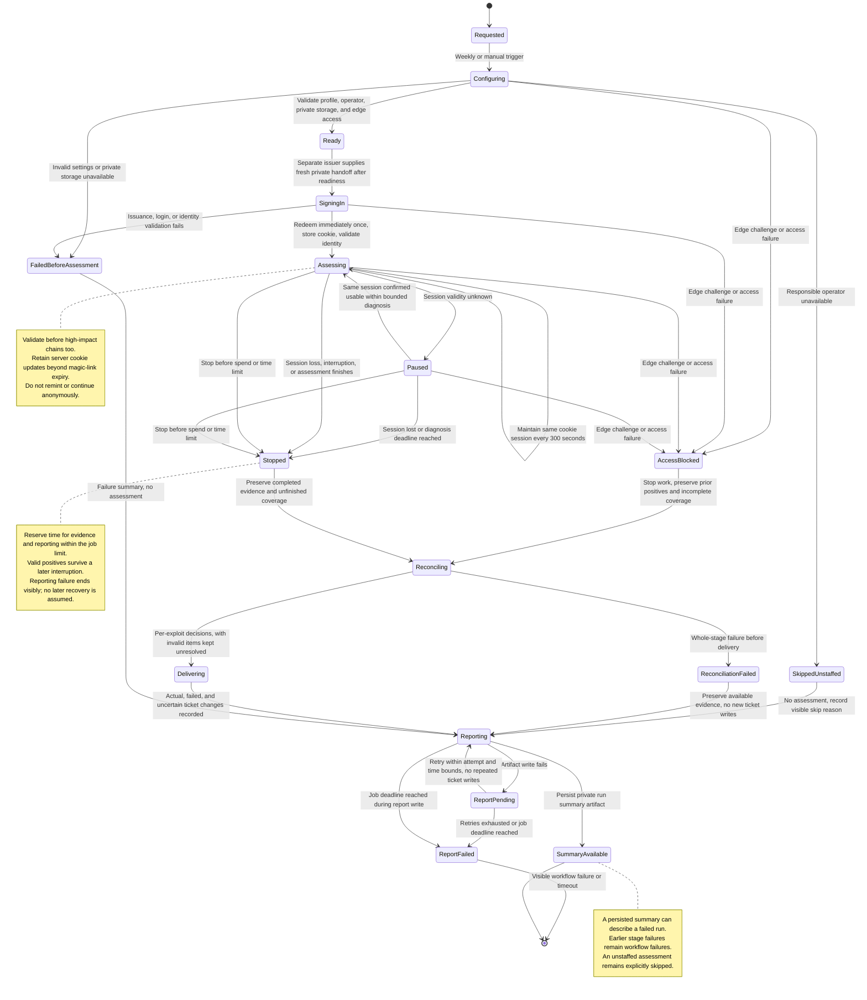

# Attack runner

## Summary

**Attack Runner** automates authenticated assessments of the party environment and turns demonstrated exploits into actionable engineering tickets. It is one project within the Attack function of Aegis. Aegis is the wider Observe → Enforce → Attack → Harden initiative.

Engineers use the results to understand an exploit, fix its complete activity chain, and assess whether a claimed fix survives another test. Operators use the run record to distinguish completed work from authentication, coverage, budget, or delivery failures.

## Terms

- **Assessment run**: one bounded execution with a unique identity, explicit target scope, resolved configuration, and evidence record.
- **Run profile**: the harness, model, attack-path revision, money budget, and time limit selected for a run.

## Decisions

### Runs are weekly and manually invocable

The initial weekly run starts Monday at 09:00 America/Los_Angeles, preserving that local time across daylight-saving changes. We start during a staffed engineering window so unexpected effects can be investigated without bringing people back on a weekend. Before enabling the schedule, the operator names the responsible engineering owner and verifies that owner can observe and stop the run. If coverage is unavailable, the scheduled run is skipped with a visible reason; it is not silently moved to an unattended time. Manual dispatch requires the same operator coverage and run contract. The workflow entry point is `.github/workflows/aegis-party-pentest.yml`.

The assessment is not a required merge gate. Failures and incomplete delivery remain visible; soft failure does not turn a failed assessment into a successful result.

### Configuration components are independently replaceable

Strix OSS is the first harness. The default assessment model is **Sonnet-4-8**. The adapter resolves this selected model to an explicit provider model identifier and records that value; it must not silently substitute another model if unsupported. Harness, model, instruction path/revision, money budget, and time limit are independent settings. The initial budget is $100 and the initial total job limit is 60 minutes. A harness adapter translates this common contract into supported harness options. Unsupported settings fail validation instead of silently falling back.

Sonnet-4-8 is the operator-selected starting default, not a claim that it is the cheapest, strongest or a validated optimum for this task. Before live release, engineering must verify the exact provider identifier, pinned-harness compatibility, required tool behavior, evidence output, usage reporting and stopping support. An unavailable or unqualified default blocks launch rather than triggering silent substitution. Terra and Grok are also possible configured assessment models if those same requirements are verified; naming them here does not establish support or select a particular provider version.

We keep these settings separate so model or harness experiments do not change finding identity or ticket policy. Changing a setting never expands the authorized target boundary.

### The first release assesses party with a maintained session

Only explicitly authorized party targets are assessed. The run establishes a fresh session and maintains it throughout authenticated work. The first path is Authenticated Access Chains. Production assessment, deliberate anonymous phases, additional implemented paths, CI scanner gates, automated ticketing for gaps in continuous integration checks, and formal deployed-version tracking are outside this release.

This boundary keeps the first service focused on repeatable authenticated assessment. The path and adapter contracts still support future additions.

Authentication is automated through a separately deployed company-owned issuer and a private temporary handoff, as defined in [Attack sessions](attack-sessions.md). Attack Runner has no superadmin access and no dependency on an employee's login or mailbox. Operator availability is still required to observe and stop the assessment; it is not a weekly authentication step.

### Findings cross repository boundaries

Linear holds exploit tickets. Each ticket includes the full activity chain, evidence, what must be fixed, and end-to-end verification expectations. The run summary output references the complete exploit-ticket list, including tickets actually opened, reopened, or updated. Slack delivery is deferred. Repository ownership is metadata, not a ticket eligibility filter.

Confirmed observations are new, rediscovered (still open), or claimed-fixed but still reproduces. Without an observation, the result is “not observed in this run,” paired with coverage and the reason the run ended. No run certifies that an exploit is fixed. Contradictory evidence reopens the existing closed ticket. Non-observation leaves resolved tickets untouched and records coverage and results only in the run summary; it never automatically closes an issue.

### Evidence is retained in private storage

Run summaries and redacted exploit evidence go to a dedicated private Google Cloud Storage bucket, partitioned by run ID. They do not go into this public repository's workflow artifacts, job summaries, logs or PR comments. Public workflow output is limited to a run ID, stage, status and non-sensitive diagnostic code; full ticket links and evidence stay in the private summary. The concrete project, bucket and authorized reader group are operator configuration and must be provisioned and access-tested before launch. This is a storage decision, not a claim that the bucket exists today.

Use uniform bucket-level access and enforced public access prevention, with encrypted storage/transport and authenticated access for the designated engineering/security readers. The trusted runner owns the storage identity; the attack harness receives only its private local evidence directory, not storage credentials. Give the runner only the access needed for its run's objects, with no bucket administration or access to unrelated evidence. A missing, unguarded or unwritable destination fails preflight before authentication or assessment. Upload failure after assessment follows bounded reporting failure; there is no fallback to a public artifact.

The initial policy schedules run artifacts for expiry after 30 days. Engineering must configure and record effective retention, including noncurrent versions, soft-deleted objects and lifecycle deletion delay, before enabling runs; a lifecycle threshold is not a promise of immediate erasure. An explicit owner-approved retention extension is recorded per case. Tickets retain the complete redacted activity chain and remediation needed to act after artifact expiry, and identify evidence that is no longer available. Durable deduplication/fix-claim state is separate from expiring artifacts. Do not place signed bearer URLs or credentials in tickets or public output; readers authenticate to the private evidence store. Verify authorized access, denied unauthorized access, redaction, read auditing and expiry handling before release.

### Edge controls must not hide missing coverage

Preflight checks the authorized target's application reachability from the actual runner/harness network path. If Cloudflare blocks that path, the environment owner can configure a narrowly scoped party-only policy for the identified assessment traffic where the deployed Cloudflare controls support it. Record the approved policy and affected scope in private run provenance. Do not disable protection for the whole zone, change production rules, or assume the runner can alter or evade challenges. Any exception limits what the assessment establishes about the normal edge configuration.

A detected Cloudflare challenge or confirmed edge block is `EDGE_CONTROL_BLOCKED`, separate from invalid application credentials or an application authorization denial. A `cf-mitigated: challenge` response is one documented challenge signal; a generic 403/429 or Cloudflare server header alone does not establish the cause. When evidence is insufficient, record `ACCESS_FAILURE_UNCLASSIFIED` and bounded diagnosis rather than guessing. If application reachability cannot be established, stop the affected assessment and mark its coverage incomplete with a visible failed run result. Do not report that no exploit exists, or file an exploit ticket solely because the edge blocked a request. Independently valid positives from before the interruption still proceed through reconciliation.

The private summary records the failure phase, affected surface, classification/evidence, available Cloudflare request identifier, observed challenge/block/unclassified-failure counts and interrupted coverage. Counts cover observed attempts, not an estimate of unobserved traffic. Missing attribution remains explicit. Repeated challenges cannot consume unbounded retries or create a false successful run. Engineering verifies the deployed edge policy and reporting signals with controlled integration cases before enabling scheduled assessments.

## Contracts

### Resolved run record

Each run records its unique ID, authorized environment/scope, pinned harness release or commit, provider/model and supported effort settings, attack-path ID, instructions Git revision and committed-content hash, money budget, time limit, responsible operator, edge-policy reference and access-failure observations, protected evidence destination/retention policy, coverage, stop reason, and evidence references. Secrets are excluded. The hash covers committed instructions, never a secret-bearing runtime copy.

Authentication provenance records the adapter-verified session mode and its coverage limitations. For each authentication attempt, the summary also records a `handoffCleanup` snapshot: observed status (`pending`, `deleted`, `failed`, `not_created`, or `unknown` when unavailable), observation time, and a stable reference to the issuer-owned private cleanup record. The issuer record holds subsequent cleanup outcomes; a completed summary is not automatically rewritten and cannot certify future cleanup. See [Attack sessions](attack-sessions.md#credentials-remain-ephemeral) for the status and ownership contract.

The adapter exposes observations in a harness-independent form and reports actual limit enforcement and usage availability. The runner stops new work before configured limits and reserves time to preserve evidence. A prompt telling a model to stay under budget is not enforcement.

### Evidence and delivery are separate results

A completed positive observation remains evidence when later work fails. Untested and interrupted work remains explicit. Run results distinguish assessment completion, reconciliation, and external delivery so an operator can retry a failed stage without claiming that a ticket already exists.

### Stage and reporting failures

If the complete reconciliation stage fails, for example because its input is structurally unreadable, the runner skips ticket delivery, preserves available redacted evidence, and reports reconciliation failure. Independent invalid findings still use per-finding triage when the rest of the input is usable. A successfully written failure summary does not turn a failed stage into a successful workflow result.

Report retries are bounded by an explicit retry limit and the remaining job time. If retries are exhausted or the job deadline is reached, reporting ends in `ReportFailed` and the workflow fails visibly. The operator sees failed or timed-out workflow status; when execution can still emit a diagnostic, its logs identify the reporting stage, run ID, cause, and summary unavailability without credentials or raw sensitive evidence. A hard timeout is itself visible even if it prevents the final diagnostic.

Summary non-observation and coverage records are not considered retained unless artifact persistence succeeds. If reporting fails, the operator must not infer a clean result or that the full record survived. Existing ticket writes are not repeated to regenerate a report. Any retry needs the original run/event identities and surviving evidence; unavailable evidence remains explicitly unavailable. No later automatic reporting-recovery process is part of this release. These visible failures remain non-gating for unrelated merges.

### Run and session lifecycle

Run completion, exploit observation, ticket state, and delivery status are separate. Ending a run never proves that an exploit is fixed.

## Product dimensions

| Dimension            | Decision                                                                                                                      | Source                                                                         |
| -------------------- | ----------------------------------------------------------------------------------------------------------------------------- | ------------------------------------------------------------------------------ |
| Access               | Authorized operators invoke runs using explicitly authorized test identities and targets.                                     | This document                                                                  |
| Seats and plans      | Not applicable; this is internal security automation, not a customer entitlement.                                             | This document                                                                  |
| Billing and metering | Harness spend is bounded per run; the first default is $100. It is not a customer billing meter.                              | This document                                                                  |
| Limits               | Initial total job limit is 60 minutes; supported budget/time overrides retain the authorized scope.                           | This document                                                                  |
| Security and data    | Authentication material is ephemeral; findings contain redacted evidence.                                                     | [Attack sessions](attack-sessions.md), [Exploit findings](exploit-findings.md) |
| Deployment           | Runs target the authorized party environment; production and self-managed assessments are outside this release.               | This document                                                                  |
| Interfaces           | Scheduled/manual GitHub Actions, Git-tracked instructions, Linear tickets, run summary artifacts; Slack delivery is deferred. | This document                                                                  |

## Resources

- [Project Aegis](https://app.notion.com/p/foxglovehq/Project-Aegis-3e4cbc8e56a381caa0e4eeaeec1c5164): initiative context.
- [Strix OSS](https://github.com/usestrix/strix): first harness and adapter entry point.
- [Private bucket building block](https://github.com/foxglove/infra/blob/0a3dbada9dc6ba6f943eba864c7cdff0855f267c/modules/components/gcs-bucket/main.tf): existing GCS IAM, public-access prevention and lifecycle configuration; explicit private settings are required.
- [Cloud Storage access controls](https://docs.cloud.google.com/storage/docs/uniform-bucket-level-access) and [public access prevention](https://docs.cloud.google.com/storage/docs/public-access-prevention): storage boundary requirements.
- [Cloudflare challenge detection](https://developers.cloudflare.com/cloudflare-challenges/challenge-types/challenge-pages/detect-response/) and [bot control configuration](https://developers.cloudflare.com/bots/additional-configurations/custom-rules/): detection signals and deployed-policy qualification.
- [Original shipping scope](https://docs.google.com/document/d/1C210loxpi1wWnBlFIbxKNfUFHGHVXyxejv2pCRAZFfE/edit): historical input; repository splitting and path naming are superseded by this design.

## References

- [Attack paths](attack-paths.md): Runs resolve a named, versioned instruction file and pass it to the harness.
- [Attack sessions](attack-sessions.md): Runs establish and maintain a fresh authenticated session.
- [Exploit findings](exploit-findings.md): Runs produce repository-independent exploit tickets and evidence.
