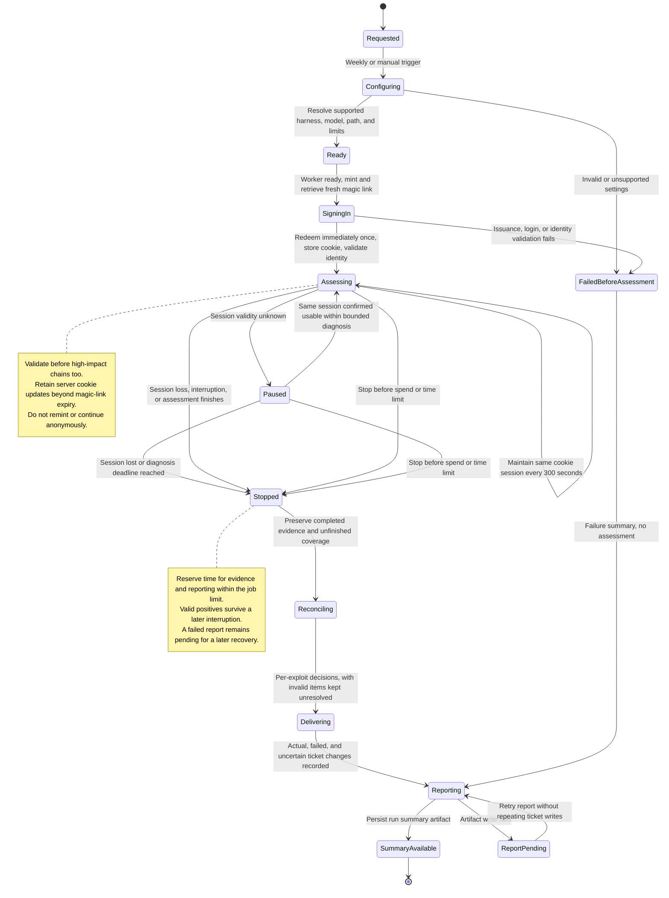

# Attack runner

## Summary

**Attack Runner** automates authenticated assessments of the party environment and turns demonstrated exploits into actionable engineering tickets. It is one project within the Attack function of Aegis. Aegis is the wider Observe → Enforce → Attack → Harden initiative.

Engineers use the results to understand an exploit, fix its complete activity chain, and assess whether a claimed fix survives another test. Operators use the run record to distinguish completed work from authentication, coverage, budget, or delivery failures.

## Terms

- **Assessment run**: one bounded execution with a unique identity, explicit target scope, resolved configuration, and evidence record.
- **Run profile**: the harness, model, attack-path revision, money budget, and time limit selected for a run.

## Decisions

### Runs are weekly and manually invocable

The weekly run starts Saturday at 07:00 America/Los_Angeles. Manual dispatch uses the same run contract. The workflow entry point is `.github/workflows/aegis-party-pentest.yml`. These entry points make routine assessment repeatable and permit investigation between scheduled runs.

The assessment is not a required merge gate. Failures and incomplete delivery remain visible; soft failure does not turn a failed assessment into a successful result.

### Configuration components are independently replaceable

Strix OSS is the first harness. The default assessment model is **Sonnet-4-8**. The adapter resolves this selected model to an explicit provider model identifier and records that value; it must not silently substitute another model if unsupported. Harness, model, instruction path/revision, money budget, and time limit are independent settings. The initial budget is $100 and the initial total job limit is 60 minutes. A harness adapter translates this common contract into supported harness options. Unsupported settings fail validation instead of silently falling back.

We keep these settings separate so model or harness experiments do not change finding identity or ticket policy. Changing a setting never expands the authorized target boundary.

### The first release assesses party with a maintained session

Only explicitly authorized party targets are assessed. The run establishes a fresh session and maintains it throughout authenticated work. The first path is Authenticated Access Chains. Production assessment, deliberate anonymous phases, additional implemented paths, CI scanner gates, automated ticketing for gaps in continuous integration checks, and formal deployed-version tracking are outside this release.

This boundary keeps the first service focused on repeatable authenticated assessment. The path and adapter contracts still support future additions.

### Findings cross repository boundaries

Linear holds exploit tickets. Each ticket includes the full activity chain, evidence, what must be fixed, and end-to-end verification expectations. The run summary output references the complete exploit-ticket list, including tickets actually opened, reopened, or updated. Slack delivery is deferred. Repository ownership is metadata, not a ticket eligibility filter.

Confirmed observations are new, rediscovered (still open), or claimed-fixed but still reproduces. Without an observation, the result is “not observed in this run,” paired with coverage and the reason the run ended. No run certifies that an exploit is fixed. Contradictory evidence reopens the existing closed ticket. Non-observation leaves resolved tickets untouched and records coverage and results only in the run summary; it never automatically closes an issue.

## Contracts

### Resolved run record

Each run records its unique ID, authorized environment/scope, pinned harness release or commit, provider/model and supported effort settings, attack-path ID, instructions Git revision and committed-content hash, money budget, time limit, coverage, stop reason, and evidence references. Secrets are excluded. The hash covers committed instructions, never a secret-bearing runtime copy.

The adapter exposes observations in a harness-independent form and reports actual limit enforcement and usage availability. The runner stops new work before configured limits and reserves time to preserve evidence. A prompt telling a model to stay under budget is not enforcement.

### Evidence and delivery are separate results

A completed positive observation remains evidence when later work fails. Untested and interrupted work remains explicit. Run results distinguish assessment completion, reconciliation, and external delivery so an operator can retry a failed stage without claiming that a ticket already exists.

### Run and session lifecycle

Run completion, exploit observation, ticket state, and delivery status are separate. Ending a run never proves that an exploit is fixed.

## Product dimensions

| Dimension            | Decision                                                                                                                      | Source                                                                         |
| -------------------- | ----------------------------------------------------------------------------------------------------------------------------- | ------------------------------------------------------------------------------ |
| Access               | Authorized operators invoke runs using explicitly authorized test identities and targets.                                     | This document                                                                  |
| Seats and plans      | Not applicable; this is internal security automation, not a customer entitlement.                                             | This document                                                                  |
| Billing and metering | Harness spend is bounded per run; the first default is $100. It is not a customer billing meter.                              | This document                                                                  |
| Limits               | Initial total job limit is 60 minutes; supported budget/time overrides retain the authorized scope.                           | This document                                                                  |
| Security and data    | Authentication material is ephemeral; findings contain redacted evidence.                                                     | [Attack sessions](attack-sessions.md), [Exploit findings](exploit-findings.md) |
| Deployment           | Runs target the authorized party environment; production and self-managed assessments are outside this release.               | This document                                                                  |
| Interfaces           | Scheduled/manual GitHub Actions, Git-tracked instructions, Linear tickets, run summary artifacts; Slack delivery is deferred. | This document                                                                  |

## Resources

- [Project Aegis](https://app.notion.com/p/foxglovehq/Project-Aegis-3e4cbc8e56a381caa0e4eeaeec1c5164): initiative context.
- [Strix OSS](https://github.com/usestrix/strix): first harness and adapter entry point.
- [Original shipping scope](https://docs.google.com/document/d/1C210loxpi1wWnBlFIbxKNfUFHGHVXyxejv2pCRAZFfE/edit): historical input; repository splitting and path naming are superseded by this design.

## References

- [Attack paths](attack-paths.md): Runs resolve a named, versioned instruction file and pass it to the harness.
- [Attack sessions](attack-sessions.md): Runs establish and maintain a fresh authenticated session.
- [Exploit findings](exploit-findings.md): Runs produce repository-independent exploit tickets and evidence.
