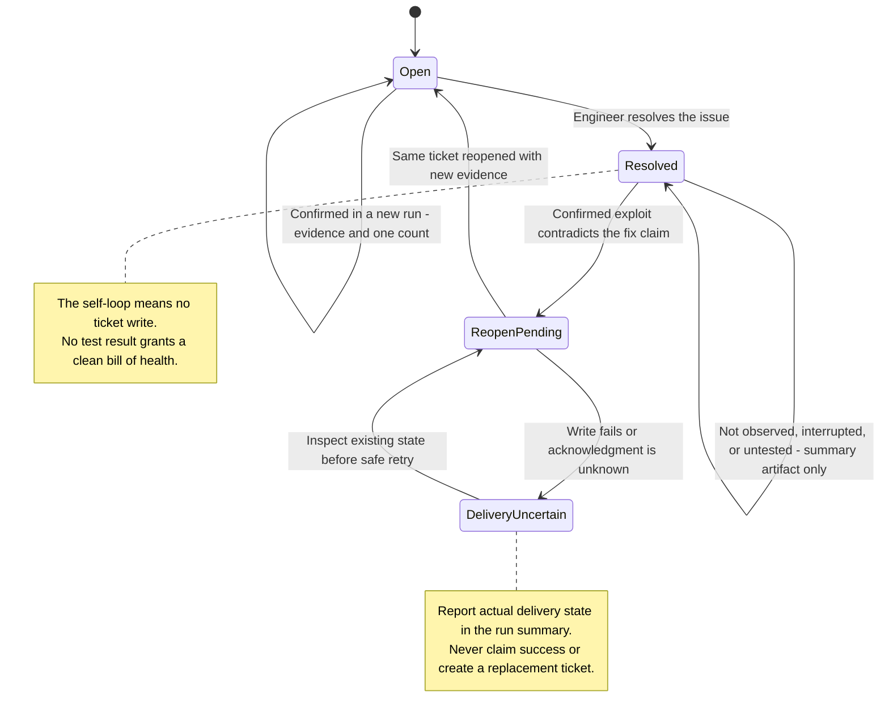
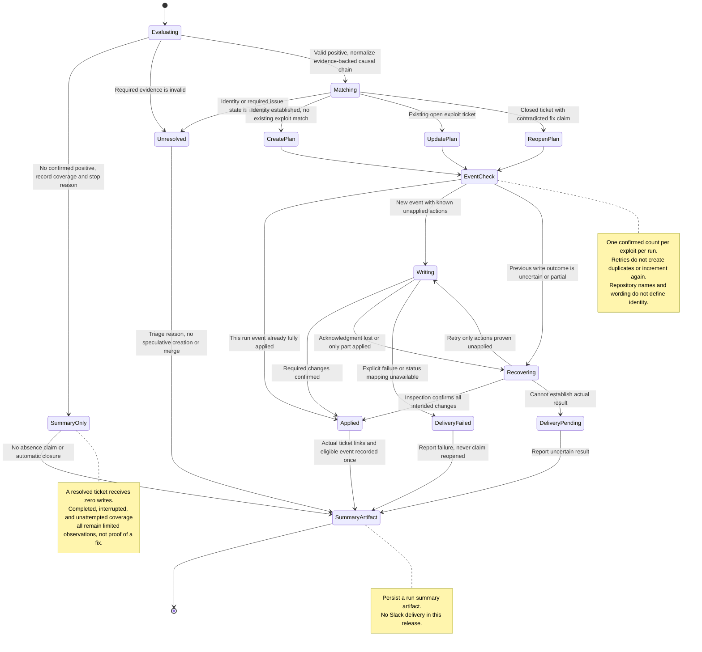

# Exploit findings

## Summary

An **exploit finding** is a demonstrated, actionable security weakness with an ordered activity chain and a corrective outcome. Linear is the finding system of record. Engineers receive one coherent ticket per exploit even when its remediation crosses repository boundaries.

## Terms

- **Activity chain**: the ordered actions, observed results, and prerequisites that demonstrate the exploit's impact.
- **Exploit identity**: the demonstrated weakness or violated boundary, affected surface, target environment, and supporting evidence used to distinguish an exploit from other exploits.

## Decisions

### Tickets represent exploits, not repositories

One ticket describes an independently actionable exploit, its complete activity chain, and all required remediation. Repository and component ownership are supporting metadata. Unknown ownership does not block an otherwise valid ticket. Independent exploits can have separate linked tickets, each with its own chain and corrective outcome.

This keeps the failure and its fix understandable when a chain crosses services or repositories. Fixing one component does not establish that the end-to-end exploit is resolved.

### Matching follows exploit identity

The same exploit discovered in another repository, by another harness/model, or through another path revision updates the same ticket. Different exploits remain distinct even within one repository. Titles and prose similarity alone cannot establish equivalence.

Ambiguous matches remain unresolved for triage rather than forcing a merge or speculative duplicate. The matching implementation preserves these semantics in its stable identity contract.

### Tickets carry actionable evidence

Every ticket explains what must be fixed and how to verify the end-to-end correction. Tickets use Bug, pentesting, and harness labels and link run/evidence artifacts. The production-impact assessment is yes, no, or unknown with a rationale; party evidence alone is not proof of production impact.

Summaries reference the complete exploit-ticket list without an app-only or per-repository filter. Routine rediscovery adds run evidence and a lean Linear count without Slack spam.

### Reconciliation distinguishes evidence outcomes

Confirmed observations are classified as new, rediscovered (still open), or claimed-fixed but still reproduces. When a run ends without observing a tracked exploit, the result is **not observed in this run**. It records what was attempted, under which conditions, and why work ended. It does not mean the exploit is absent, fixed, or impossible to reproduce. Even a completed targeted re-test cannot provide that assurance.

Observation and execution status are separate: not observed can accompany completed, timed-out, session-lost, interrupted, or not-attempted coverage. No observation must not become a clean bill of health. Malformed evidence and ambiguous identity remain unresolved processing states. A valid positive observation is not cancelled by a later attempt that fails to observe the exploit.

### Non-observation never closes a ticket

A run that does not observe the exploit never automatically closes an issue or validates an engineer's fix claim. When an engineer has resolved the ticket, non-observation leaves it untouched: no comment, evidence attachment, counter change, or lifecycle update. Record attempted coverage, conditions, evidence references, and the stop reason only in the run summary. This also applies when a targeted re-test completes, is interrupted, or is not attempted. Only confirmed contradictory evidence triggers reopening and a ticket update. This preserves the distinction between a limited observation and engineering closure and avoids repetitive updates to resolved tickets.

### Contradictory evidence reopens the existing ticket

When a confirmed observation contradicts an explicit engineer fix claim, the reconciler appends the new chain evidence, links the claim, and returns that same ticket to the team's mapped open state if it is closed. An already-open ticket stays open and receives the evidence. It does not create a replacement ticket. A failed or unmapped transition is a visible delivery failure; the summary does not claim the ticket was reopened.

### Confirmations are counted once per run

Count a confirmed exploit once per distinct assessment run. Duplicate observations, transport retries, and replay do not increase the count. A new run with a confirmed observation adds one. Preserve known historical counts; unknown history remains unknown rather than inventing a starting total.

### Each run produces a summary output

The current release produces a run summary artifact, including tickets actually opened, reopened, or updated and their links. It also lists unresolved matches, failed writes, non-observations, coverage, stop reasons, and available spend/time. Proposed actions and unacknowledged writes are distinguished from confirmed ticket changes. The summary includes all repositories and unknown ownership.

New actionable exploits and fresh contradictions of a newly recorded fix claim are notification-eligible events. Repeat events for the same exploit/fix-claim episode, routine rediscovery, and non-observation do not create another alert. Every run still produces its summary, including when no ticket is opened. Slack delivery is deferred; eligibility does not send a message in the current release.

## Contracts

### Ticket material

Each actionable ticket contains:

- Exploit identity, affected boundary/surface, severity, impact, and qualified production-impact rationale.
- Preconditions and actor/session role with credentials omitted.
- Ordered steps: action, relevant request or operation, observed result, evidence reference, and what becomes possible next.
- A distinction between demonstrated effects, blocked steps, and dangerous actions not executed.
- What must change to prevent the exploit, including all necessary component fixes.
- End-to-end re-test expectations and run/artifact references.
- Known repository/component ownership, or an explicit unknown value.

### Structured chain identity

An activity chain is represented by evidence-backed transitions and their causal prerequisites, not by its title or narrative wording. Each transition records:

| Field                | Meaning                                                                                         |
| -------------------- | ----------------------------------------------------------------------------------------------- |
| Actor capability     | Starting role and relation to the affected resource, such as a member of another tenant         |
| Target and operation | Stable surface/resource class and operation, such as reading an export through its download API |
| Expected boundary    | The permission or isolation rule that should prevent the action                                 |
| Observed transition  | The unauthorized capability or effect actually demonstrated                                     |
| Prerequisites        | Earlier transitions or conditions that enabled this step                                        |
| Evidence             | The request/operation and observed result supporting that transition, with secrets removed      |

The matching core comprises the target environment, violated control or boundary, affected logical surface, and causally relevant transitions that demonstrate the exploit and define its corrective outcome. It excludes narrative wording, ticket titles, incidental reconnaissance, timestamps, run IDs, generated resource IDs, credentials, repository names, harness/model, and path revision. Concrete request details remain in evidence. Normalization preserves role/tenant relationships and semantic ordering; it must not erase a distinct control failure or merge independent exploits merely because they share a weakness category.

Before opening a ticket, the reconciler normalizes the observed chain and compares it against relevant existing tickets and observations in the current run. It records why a candidate is the same exploit or why a distinct ticket is warranted. Wording differences and alternate evidence of the same control failure do not create another ticket. An added independently actionable control failure can warrant a separate linked ticket. Ambiguity routes to triage without speculative creation or merging.

A stable exploit ID is assigned after identity is established and reused on subsequent runs. A versioned fingerprint of normalized fields is a lookup aid, not proof of equivalence. Changes to normalization must preserve existing IDs through migration or aliases, rather than creating duplicates. A language model may suggest structured fields or candidate matches; an unsupported similarity judgment cannot authorize a merge. Narrative embeddings or a hash of prose alone are insufficient.

### Identity example

“A tenant member downloads another organization's export” and “Cross-org export disclosure through the download API” describe the same exploit when evidence shows the same actor/resource relationship, download surface, missing ownership check, and unauthorized read. Different export IDs or wording do not change identity. A separate share-token validation failure is not automatically the same exploit merely because it also exposes exports. No actual finding is asserted by these examples.

### Partial evidence

Completed positive observations remain usable if another part of the run fails. Unfinished coverage and unresolved identity are explicit. Neither overall run failure nor absence from a new finding list means that a known exploit is fixed.

### Ticket lifecycle

### Finding reconciliation and delivery

The following applies per exploit. Valid independent findings survive other invalid findings. The run summary is an artifact, not a Linear comment. Actual ticket writes are tracked separately from proposed changes.

## Product dimensions

| Dimension            | Decision                                                                                                                 | Source        |
| -------------------- | ------------------------------------------------------------------------------------------------------------------------ | ------------- |
| Access               | Findings are engineering triage material; evidence sharing follows the configured artifact and Linear access boundaries. | This document |
| Seats and plans      | Not applicable; exploit tickets do not grant a customer entitlement.                                                     | This document |
| Billing and metering | The lean reproduction count is operational evidence, not a billing meter.                                                | This document |
| Limits               | One ticket per independently actionable exploit; repository boundaries do not multiply tickets.                          | This document |
| Security and data    | Tickets and durable evidence exclude credentials and distinguish observed from inferred impact.                          | This document |
| Deployment           | Findings identify the assessed target environment; party results do not establish production impact.                     | This document |
| Interfaces           | Normalized observations, Linear tickets, run summaries, and eligible notification summaries.                             | This document |

## Alternatives considered

### One ticket for every affected repository

Splitting an exploit by repository hides its complete chain and can suggest that a partial component fix resolves it. Repository ownership belongs in the exploit ticket's remediation details.

## Resources

- [Original reconciliation scope](https://docs.google.com/document/d/1C210loxpi1wWnBlFIbxKNfUFHGHVXyxejv2pCRAZFfE/edit): the four outcomes, Linear labels, and run evidence.

## References

None.
